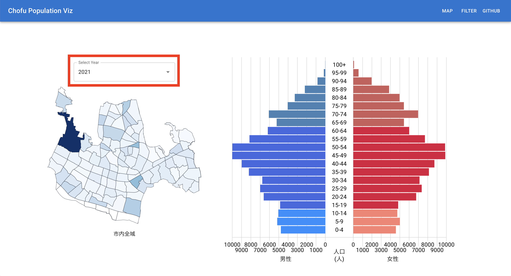
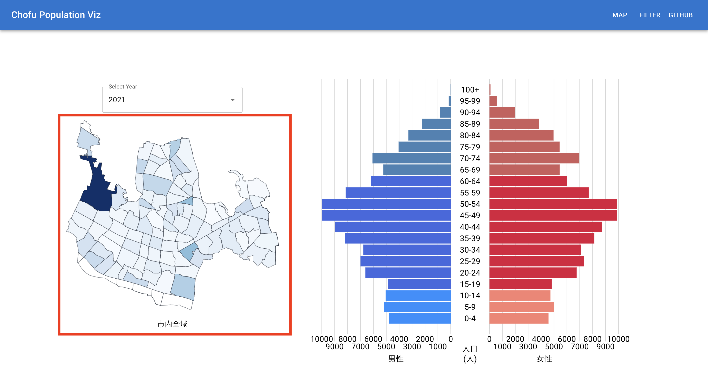
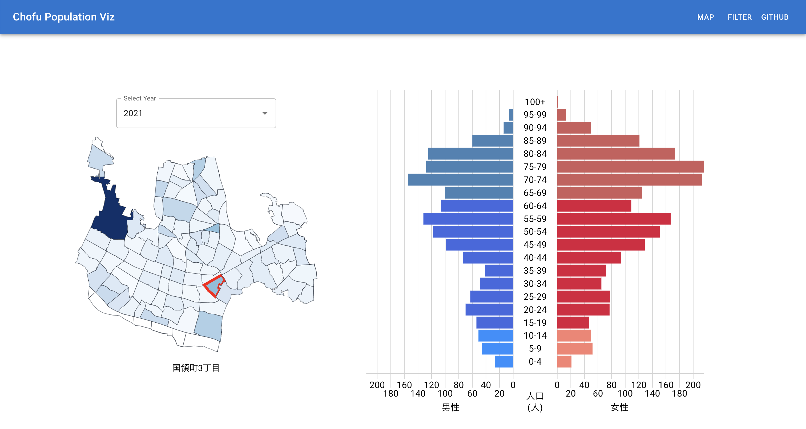
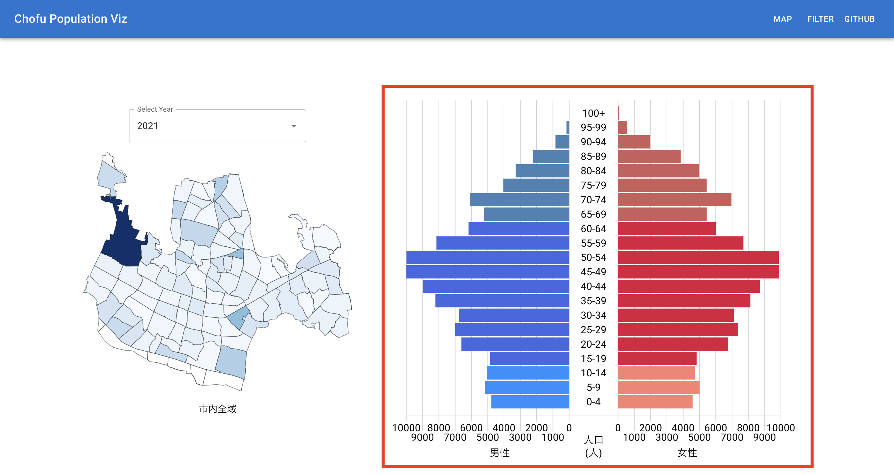
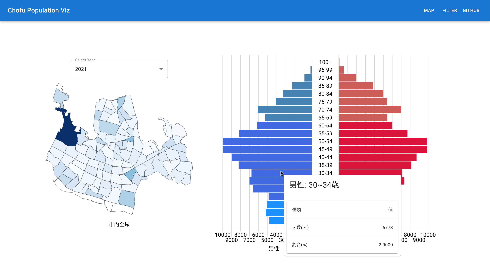

# Chofu Population Vis

調布市の地域別人口ピラミッドです．  
地図のデータは[国土地理院基盤地図情報](https://fgd.gsi.go.jp/download/menu.php)を使用しています．

人口統計データは[Shirashoji/chofu-population-dataset](https://github.com/Shirashoji/chofu-population-dataset)にある通りです．

Netlify にデプロイしてあります．  
https://chofu-population-vis.netlify.app/

## 説明

人口ピラミッド，地図のデータの年を選択できます．

地図の塗り分けは，市内全域の人口ピラミッドと形が離れているほど濃く表示されます．  
地図の地域を選択すると，その地域の人口ピラミッドが表示されます．  
デフォルトでは市内全域の人口ピラミッドが表示されます．

国領三丁目の地図を選択したものが上の画像です．

人口ピラミッドは，年少年齢，生産年齢，高齢者で色分けされています．

マウスカーソルを合わせると Tooltip が表示されます．
